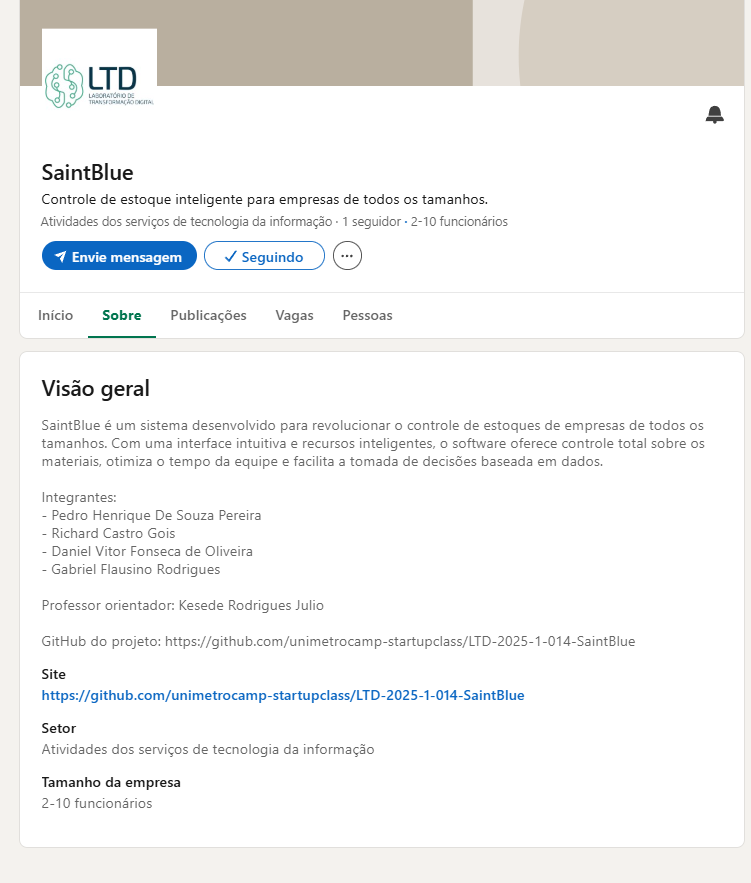

<h1 align="center">Documentação do Sistema</h1>

<strong>SUMÁRIO</strong>

[Dados do Cliente	2](#_heading=h.gjdgxs)

[Equipe de Desenvolvimento	3](#_heading=h.30j0zll)

[1. Introdução	4](#_heading=h.1fob9te)

[2. Objetivo	5](#_heading=h.3znysh7)

[3. Escopo	6](#_heading=h.2et92p0)

[4. Backlogs do Produto	7](#_heading=h.tyjcwt)

[5. Cronograma	8](#_heading=h.3dy6vkm)

[6. Materiais e Métodos	9](#_heading=h.1t3h5sf)

[7. Resultados	10](#_heading=h.4d34og8)

[8. Conclusão	11](#_heading=h.2s8eyo1)

[9. Homologação do MVP junto ao cliente	12](#_heading=h.17dp8vu)

[10. Divulgação	13](#_heading=h.3rdcrjn)

[11. Carta de Apresentação	15](#_heading=h.26in1rg)

[12. Carta de Autorização	16](#_heading=h.lnxbz9)

[13. Relato individual do processo	18](#_heading=h.35nkun2)

|<h1>**Dados do Cliente**</h1>|
| - |
Título do Projeto:** SaintBlue: Sistema inteligente para controle e gestão de estoques empresariais

Cliente: Emily Fonseca de Oliveira

CNPJ/CPF: 473.644.078/39

Contato: 19 99425-3962

Email do contato: emillycoutinho83@gmail.com

|<h1>**Equipe de Desenvolvimento** </h1>|
| - |
|**Nome completo**|**Curso**|**Disciplina**|
| :-: | :-: | :-: |
|Daniel Vitor Fonseca de Oliveira|ADS|Programação orientada a objetos em Java|
|Richard Castro Gois|ADS|Programação orientada a objetos em Java|
|Pedro Henrique De Souza Pereira|ADS|Programação orientada a objetos em Java|
|Gabriel Flausino Rodrigues|ADS|Programação orientada a objetos em Java|
||||

|**Professor Orientador**|
| :-: |
|Kesede Rodrigues Julio|

|<h1>1. **Introdução**</h1>|
| - |

Muitas empresas, principalmente de pequeno e médio porte, enfrentam dificuldades para controlar seus estoques de forma eficiente, ocasionando perdas financeiras, falta de materiais ou excesso de compras desnecessárias. Para resolver esse problema, o projeto SaintBlue propõe o desenvolvimento de um sistema completo e intuitivo de gerenciamento de estoque, acessível e adaptável a empresas de diferentes tamanhos e segmentos. O sistema será desenvolvido utilizando tecnologias como HTML, CSS, JavaScript e Figma no front-end para garantir uma interface amigável e responsiva, enquanto o Flask (Python) será usado no back-end para tratar as lógicas de negócio e rotas da aplicação. O PostgreSQL será utilizado como banco de dados relacional principal, e ferramentas de visualização de dados e Big Data serão incorporadas para análise avançada e geração de relatórios estratégicos. Com o SaintBlue, empresas terão um controle mais inteligente e preciso dos seus estoques, reduzindo perdas e aumentando a eficiência operacional.

|<h1>2. **Objetivo**</h1>|
| - |

O projeto SaintBlue tem como objetivo resolver a dificuldade que muitas empresas enfrentam ao controlar seus estoques de forma eficiente e segura. Atualmente, esse processo é feito, muitas vezes, de forma manual ou com planilhas descentralizadas, o que pode causar perdas de materiais, erros de contagem, atrasos em reposições e até impactos financeiros. O sistema proposto irá automatizar todo o fluxo de gerenciamento de estoque — desde o cadastro de produtos, controle de entradas e saídas, até a geração de relatórios e alertas — proporcionando maior controle, precisão e agilidade nas decisões logísticas das empresas.

|<h1>3. **Escopo**</h1>|
| - |

O sistema SaintBlue terá como foco principal a automação do controle de estoque, com a implementação dos seguintes requisitos macro:

1. Cadastro e gerenciamento de produtos e categorias: o sistema permitirá o registro completo de produtos com informações como nome, quantidade, unidade, validade, fornecedor, entre outros, além da organização por categorias personalizadas.
1. Controle de entradas e saídas: será possível registrar movimentações de estoque com datas, responsáveis e observações, mantendo o histórico completo e atualizado em tempo real.
1. Geração de relatórios e visualização gráfica de dados: gráficos e relatórios automáticos serão gerados para apoiar a análise de consumo, estoque mínimo, previsões de reposição e desempenho geral.

O projeto não incluirá, nesta fase, funcionalidades como controle financeiro, integração com sistemas externos de vendas ou módulos de pedidos automatizados por cliente. Essas funcionalidades poderão ser consideradas em versões futuras do sistema, após validação da versão inicial.

|<h1>4. **Backlogs do Produto**</h1>|
| - |

**Lista Expandida de Requisitos**

1. **Cadastro de Produtos**
   ` `Permitir o registro de novos produtos com informações como nome, código interno, unidade de medida, quantidade atual, data de validade (se aplicável) e fornecedor.
1. **Gerenciamento de Categorias**
   ` `Criar, editar e excluir categorias para organizar os produtos, facilitando a visualização e controle.
1. **Entrada de Produtos no Estoque**
   ` `Funcionalidade para adicionar itens ao estoque, informando data da entrada, quantidade, responsável e possível observação.
1. **Saída de Produtos do Estoque**
   ` `Registrar a saída de materiais, com os mesmos dados da entrada, permitindo controle sobre o consumo e destino dos itens.
1. **Consulta de Histórico de Movimentações**
   ` `Exibir um histórico detalhado das movimentações (entradas e saídas) de cada produto, filtrando por datas e categorias.
1. **Visualização Gráfica de Dados**
   ` `Implementar dashboards com gráficos de consumo, movimentações mensais e projeções, usando ferramentas de visualização de dados (ex: Chart.js, Plotly ou similares).
1. **Autenticação de Usuário**
   ` `Sistema de login com controle de acesso básico, para garantir a segurança das informações do estoque.
1. **Interface Responsiva e Intuitiva**
   ` `Utilizar boas práticas de UX/UI no design da interface, com layout limpo, fácil navegação e compatível com diferentes dispositivos.

|<h1>5. **Cronograma**</h1>|
| - |
|**Fase**|**Atividade**|**Duração**|**Data de Início**|**Data de Término**|
| :-: | :-: | :-: | :-: | :-: |
|**Planejamento**|Definição de requisitos e escopo|1 semana|08/04/2025|14/04/2025|
|**Design**|Protótipo da interface e experiência do usuário|1 semana|15/04/2025|21/04/2025|
|**Desenvolvimento - Frontend**|Implementação do painel administrativo|2 semanas|22/04/2025|05/05/2025|
|**Desenvolvimento - Backend**|Criação da API, banco de dados e integração|2 semanas|06/05/2025|19/05/2025|
|**Integração e Testes**|Conectar frontend ao backend, testar e corrigir erros|1 semana|20/05/2025|26/05/2025|
|**Implantação**|Publicação do sistema e ajustes finais|1 semana|27/05/2025|02/06/2025|
|**Entrega Final**|Apresentação ao cliente e treinamento|1 dia|03/06/2025|03/06/2025|

|<h1>6. **Materiais e Métodos**</h1>|
| - |

1. **Modelagem do sistema**: <Dica: a modelagem do seu sistema são diagramas (desenhos) da sua estrutura ou comportamento. A UML (Unified Modelling Language) oferece diversos diagramas para que você possa modelar seu sistema. Escolha, pelo menos, dois modelos e insira aqui. Por exemplo, Modelo de Dados (Diagrama de Classe ou MER), Casos de Uso, Diagrama de Sequência, Diagrama de Atividades etc. Estes modelos são próprios para construção da comunicação, entendimento e implantação dos requisitos do sistema. Você pode usar ferramentas, como: LucidChart, Draw.io etc. Veja exemplos em [Diagramas UML: exemplo e modelos | Lucidchart Blog](https://www.lucidchart.com/blog/pt/modelos-e-exemplos-de-diagramas-uml)>. Recomendo os diagramas: Caso de Uso: mostra as relações entre Atores e Processos, Diagrama de Classes: mostra as relações entre as classes (quando houver) do sistema e o MER (Modelo Entidade-Relacionamento): mostra as relações entre os dados das tabelas de BD. Mas cada sistema pede diagramas diferentes. Portanto, aplique conforme necessidade;
1. **Tecnologias utilizadas**: <Dica: escreva quais linguagens foram utilizadas, quais  frameworks, bibliotecas e API’s consumidas/criadas. Quais ferramentas foram usadas para desenho dos modelos. Para cada um deles, faça uma pequena descrição de uso.>

1. **Arquitetura do sistema**: <Dica: insira aqui uma imagem contendo a arquitetura do sistema e o fluxo das informações. Se a arquitetura for muito simples, detalhe o fluxo dos processos. (veja um exemplo na figura 1 (pag. 79) deste artigo: [Monitor de WhatsApp: Um Sistema para Checagem de Fatos no Combate à Desinformação](https://www.researchgate.net/publication/355943388_Monitor_de_WhatsApp_Um_Sistema_para_Checagem_de_Fatos_no_Combate_a_Desinformacao)>. Este diagrama será muito bom para usar no banner da FENETEC.

|<h1>7. **Resultados**</h1>|
| - |

1. **Protótipo**: <Dica: são as telas do software e suas descrições. Em cada uma delas, descreva as ações possíveis do usuário e reações do sistema. Isto pode ser feito através do print das telas do seu sistema. As telas não podem ocupar muito espaço da página, porém também não podem ficar ilegíveis>
1. **Códigos das principais funcionalidades**: <Dica: copy-cole aqui as seções mais relevantes do seu código. Insira comentários sobre cada seção.>

|<h1>8. **Conclusão**</h1>|
| - |

1. **Impacto do sistema:** <Dica: como o sistema impactou (alterou positivamente) o processo do cliente>
1. **Melhorias Futuras**: <Dica: elencar, pelo menos, uma melhoria que poderá ser realizada futuramente no sistema.>

|<h1>9. **Homologação do MVP junto ao cliente**</h1>|
| - |

Após as entregas parciais, realizadas de acordo com os requisitos do sistema  e cronograma, o MVP foi apresentado em uma reunião, realizada entre o time de desenvolvedores e o cliente.

<Dica: inserir uma foto da homologação em cada linha do quadro abaixo. Serão 4 fotos (tiradas no momento da homologação) e, na linha debaixo, uma legenda para cada uma delas. A homologação, preferencialmente, deve ser presencial. Se não for viável, pode ser feita por videoconferência com prints da tela.>

|<foto 1: foto do time e cliente com o primeiro slide de fundo>|<foto 2: foto de um integrante apresentando o MVP.>|
| :-: | :-: |
|Da esquerda para direita: <legenda 1: descreva quem está na foto>|<legenda 2: coloque o nome de quem está apresentando>|
|<foto 3: foto dos participantes assistindo a homologação>|<foto 4: foto do plano geral do local>|
|Participantes da homologação assistindo a apresentação|Participantes da homologação|

Segue abaixo a lista de presentes na homologação do MVP.

|**Lista de presentes na Homologação**|
| :-: |
|<Cole aqui a foto da lista de presentes na homologação.>|

Ao final da apresentação, o sistema  foi homologado pelo cliente.

|<h1>10. **Divulgação**</h1>|
| - |

1. **Linkedin do Projeto**

   

|https://www.linkedin.com/company/saintblue/about/?viewAsMember=true|
| :- |

1. **Seminário de Projetos de Software**

   **Vídeo da apresentação:** <Grave sua apresentação, poste no Linkedin do projeto e insira aqui o link público (acesso sem login) do vídeo da apresentação>

   <Na tabela abaixo, inserir uma foto da apresentação em cada linha. Serão 4 fotos (tiradas no momento da apresentação). Para cada foto, descreva uma legenda na linha de baixo.>

|<foto 1: foto do time com o primeiro slide de fundo>|<foto 2: foto de um integrante apresentando o sistema.>|
| :-: | :-: |
|Da esquerda para direita: <legenda 1: descreva quem está na foto>|<legenda 2: coloque o nome de quem está apresentando>|
|<foto 3: foto plano geral da apresentação de frente para o fundo da sala>|<foto 4:  foto plano geral da apresentação do fundo para a frente da sala>|
|Participantes do evento assistindo a apresentação|Participantes do evento assistindo a apresentação|

Segue abaixo a lista de presentes na apresentação.

|**Lista de presentes na Apresentação**|
| :-: |
|<Faça uma lista de presença numa folha A4, contendo no alto da folha “Seminários de Projetos de Software”. A lista deve conter ra, nome e assinatura dos presentes. Cole aqui a foto desta lista.>|

1. **FENETEC: Feira de Negócios em Tecnologia**

   **Apresentação do projeto:** <Um vídeo deve ser produzido mostrando o time apresentando seu projeto para algum visitante. Importante que neste video tenha uma tomada do banner e dos integrantes. Insira aqui o link público deste vídeo.>

   <Na tabela abaixo, inserir uma foto da apresentação em cada linha. Serão 4 fotos (tiradas do evento). Para cada foto, descreva uma legenda na linha de baixo.>

|<foto 1: foto do time ao lado do poster>|<foto 2: foto de um integrante apresentando o sistema.>|
| :-: | :-: |
|Da esquerda para direita: <legenda 1: descreva quem está na foto>|<legenda 2: coloque o nome de quem está apresentando>|
|<foto 3: foto do público assistindo sua apresentação>|<foto 4:  foto plano geral da FENETEC>|
|Participantes do evento assistindo a apresentação|Estandes da FENETEC|

Segue abaixo a lista de presentes na FENETEC.

|**Lista de presentes na Apresentação**|
| :-: |
|<cole aqui a lista de presença dos visitantes da FENETEC com nome e email do visitante . Os próprios times farão um form contendo no cabeçalho: Lista de Visitantes FENETEC. Compartilhe a planilha gerada pelo form com todos os times.>|

|<h1>11. **Carta de Apresentação**</h1>|
| - |
Vimos por desta apresentar o grupo de acadêmicos do Centro Universitário Unimetrocamp, localizada à Rua Sales de Oliveira, 1661 - Campinas - SP, a fim de convidá-lo a participar de uma atividade extensionista associada ao componente curricular <inserir o nome da disciplina>, sob responsabilidade do orientador Prof. Kesede Rodrigues Julio (profkesede64@gmail.com).

Em consonância ao Plano Nacional de Educação vigente, o Centro Universitário Unimetrocamp promove o Desenvolvimento de Software que, norteados pela metodologia de Gerenciamento Ágil Scrum, tem por princípios fundantes o diagnóstico dos problemas/demandas/necessidades, a participação ativa dos interessados/públicos participantes, a construção dialógica, coletiva e experiencial de conhecimentos, o planejamento de ações, o desenvolvimento e avaliação das ações, a sistematização dos conhecimentos, a avaliação das ações desenvolvidas.

Nesse contexto, a disciplina acima mencionada tem como principal escopo os temas relacionados à Programação Orientada à Objeto / Padrões de Projetos de Software, no que diz respeito ao desenvolvimento de um software utilizando Programação Orientada à Objeto.

Sendo assim, pedimos o apoio de <nome do cliente> para a realização das seguintes atividades: levantamento de requisitos, validação das entregas parciais, revalidação dos requisitos, homologação do MVP, ou qualquer outra intervenção que auxilie no desenvolvimento das competências de nossos acadêmicos e ao mesmo tempo possa contribuir para a comunidade em que estamos inseridos.

Aproveitamos a oportunidade para solicitarmos, em caso de aceite, que a parceria seja formalizada, mediante assinatura da Carta de Autorização, as atividades e informações que o(s) aluno(s) poderá(ão) ter acesso.

Em tempo, registramos ainda, o convite para a participação de todos os interessados no fórum semestral de acompanhamento e avaliação das atividades realizadas, que está previsto para o final deste semestre, e será comunicado previamente em convite específico.

Desde já nos colocamos à sua disposição para quaisquer esclarecimentos.

Atenciosamente,

Campinas, \_\_\_\_ de \_\_\_\_\_\_\_\_\_ de 202\_\_\_.

\_\_\_\_\_\_\_\_\_\_\_\_\_\_\_\_\_\_\_\_\_\_\_\_\_\_\_\_\_\_\_\_\_\_\_\_

**Assinatura Direção Acadêmica da IES**

` `

\_\_\_\_\_\_\_\_\_\_\_\_\_\_\_\_\_\_\_\_\_\_\_\_\_\_\_\_\_\_\_\_\_\_\_\_

**Assinatura Docente**

|<h1>12. **Carta de Autorização**</h1>|
| - |
Eu, (preencher com nome do responsável), (preencher com cargo ocupado), da (nome da empresa, organização, associação, escola, secretaria, etc., situada no endereço – inserir o endereço), autorizo a realização das seguintes atividades acadêmicas do componente extensionista <código e nome da disciplina>, do Centro Universitário Unimetrocamp, sob orientação do Prof. Kesede Rodrigues Julio.

|**Atividades:**|
| - |
|** |
|** |
|** |
|** |

Conforme combinado em contato prévio, as atividades acima descritas são autorizadas para os seguintes alunos:

|**Nome dos/das alunos/as**|**Curso**|**Matrícula**|
| :-: | :-: | :-: |
| | | |
| | | |
| | | |
| | | |
||||

Declaro que fui informado por meio da **Carta de Apresentação** sobre as características e objetivos das atividades que serão realizadas na organização/instituição/empresa a qual represento e afirmo estar ciente de tratar-se de uma atividade realizada com intuito **exclusivo de ensino de alunos de graduação**, sem a finalidade de exercício profissional.

Desta forma, autorizo, em caráter de confidencialidade:

- ` `o acesso a informações e dados que forem necessários à execução da atividade;
- ` `o registro de imagem por meio de fotografias;
- ` `outro: (especificar)

Campinas, \_\_\_ de \_\_\_\_\_\_\_\_\_\_\_de 202\_.

\_\_\_\_\_\_\_\_\_\_\_\_\_\_\_\_\_\_\_\_\_\_\_\_\_\_\_\_\_\_\_\_\_\_\_\_\_\_\_\_\_\_\_\_\_\_\_\_\_\_\_\_\_\_\_\_\_\_\_\_\_\_\_\_\_\_\_

(Assinatura, nome completo do responsável, email de contato e com carimbo da empresa)

|<h1>13. **Relato individual do processo**</h1>|
| - |

|<nome do aluno>|
| :- |
|<um breve relato pessoal sobre o trabalho extensionista desenvolvido>|

|<nome do aluno>|
| :- |
|<um breve relato pessoal sobre o trabalho extensionista desenvolvido>|

|<nome do aluno>|
| :- |
|<um breve relato pessoal sobre o trabalho extensionista desenvolvido>|

|<nome do aluno>|
| :- |
|<um breve relato pessoal sobre o trabalho extensionista desenvolvido>|

|<nome do aluno>|
| :- |
|<um breve relato pessoal sobre o trabalho extensionista desenvolvido>|

|/18|
| -: |

