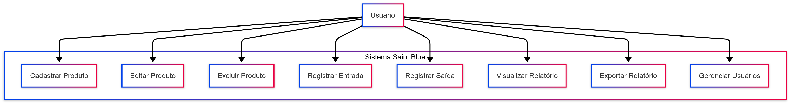

**Documentação do Sistema**

SUMÁRIO

[Dados do Cliente	2](#_heading=h.gjdgxs)

[Equipe de Desenvolvimento	3](#_heading=h.30j0zll)

[1. Introdução	4](#_heading=h.1fob9te)

[2. Objetivo	5](#_heading=h.3znysh7)

[3. Escopo	6](#_heading=h.2et92p0)

[4. Backlogs do Produto	7](#_heading=h.tyjcwt)

[5. Cronograma	8](#_heading=h.3dy6vkm)

[6. Materiais e Métodos	9](#_heading=h.1t3h5sf)

[7. Resultados	10](#_heading=h.4d34og8)

[8. Conclusão	11](#_heading=h.2s8eyo1)

[9. Homologação do MVP junto ao cliente	12](#_heading=h.17dp8vu)

[10. Divulgação	13](#_heading=h.3rdcrjn)

[11. Carta de Apresentação	15](#_heading=h.26in1rg)

[12. Carta de Autorização	16](#_heading=h.lnxbz9)

[13. Relato individual do processo	18](#_heading=h.35nkun2)

|<h1>**Dados do Cliente**</h1>|
| - |
Título do Projeto:** SaintBlue: Sistema inteligente para controle e gestão de estoques empresariais

Cliente: Emily Fonseca de Oliveira

CNPJ/CPF: 473.644.078/39

Contato: 19 99425-3962

Email do contato: emillycoutinho83@gmail.com

|<h1>**Equipe de Desenvolvimento** </h1>|
| - |
|**Nome completo**|**Curso**|**Disciplina**|
| :-: | :-: | :-: |
|Daniel Vitor Fonseca de Oliveira|ADS|Programação orientada a objetos em Java|
|Richard Castro Gois|ADS|Programação orientada a objetos em Java|
|Pedro Henrique De Souza Pereira|ADS|Programação orientada a objetos em Java|
|Gabriel Flausino Rodrigues|ADS|Programação orientada a objetos em Java|
||||

|**Professor Orientador**|
| :-: |
|Kesede Rodrigues Julio|

|<h1>1. **Introdução**</h1>|
| - |

Muitas empresas, principalmente de pequeno e médio porte, enfrentam dificuldades para controlar seus estoques de forma eficiente, ocasionando perdas financeiras, falta de materiais ou excesso de compras desnecessárias. Para resolver esse problema, o projeto SaintBlue propõe o desenvolvimento de um sistema completo e intuitivo de gerenciamento de estoque, acessível e adaptável a empresas de diferentes tamanhos e segmentos. O sistema será desenvolvido utilizando tecnologias como HTML, CSS, JavaScript e Figma no front-end para garantir uma interface amigável e responsiva, enquanto o Flask (Python) será usado no back-end para tratar as lógicas de negócio e rotas da aplicação. O PostgreSQL será utilizado como banco de dados relacional principal, e ferramentas de visualização de dados e Big Data serão incorporadas para análise avançada e geração de relatórios estratégicos. Com o SaintBlue, empresas terão um controle mais inteligente e preciso dos seus estoques, reduzindo perdas e aumentando a eficiência operacional.

|<h1>2. **Objetivo**</h1>|
| - |

O projeto SaintBlue tem como objetivo resolver a dificuldade que muitas empresas enfrentam ao controlar seus estoques de forma eficiente e segura. Atualmente, esse processo é feito, muitas vezes, de forma manual ou com planilhas descentralizadas, o que pode causar perdas de materiais, erros de contagem, atrasos em reposições e até impactos financeiros. O sistema proposto irá automatizar todo o fluxo de gerenciamento de estoque — desde o cadastro de produtos, controle de entradas e saídas, até a geração de relatórios e alertas — proporcionando maior controle, precisão e agilidade nas decisões logísticas das empresas.

|<h1>3. **Escopo**</h1>|
| - |

O sistema SaintBlue terá como foco principal a automação do controle de estoque, com a implementação dos seguintes requisitos macro:

1. Cadastro e gerenciamento de produtos e categorias: o sistema permitirá o registro completo de produtos com informações como nome, quantidade, unidade, validade, fornecedor, entre outros, além da organização por categorias personalizadas.
1. Controle de entradas e saídas: será possível registrar movimentações de estoque com datas, responsáveis e observações, mantendo o histórico completo e atualizado em tempo real.
1. Geração de relatórios e visualização gráfica de dados: gráficos e relatórios automáticos serão gerados para apoiar a análise de consumo, estoque mínimo, previsões de reposição e desempenho geral.

O projeto não incluirá, nesta fase, funcionalidades como controle financeiro, integração com sistemas externos de vendas ou módulos de pedidos automatizados por cliente. Essas funcionalidades poderão ser consideradas em versões futuras do sistema, após validação da versão inicial.

|<h1>4. **Backlogs do Produto**</h1>|
| - |

**Lista Expandida de Requisitos**

1. **Cadastro de Produtos**\
   ` `Permitir o registro de novos produtos com informações como nome, código interno, unidade de medida, quantidade atual, data de validade (se aplicável) e fornecedor.
1. **Gerenciamento de Categorias**\
   ` `Criar, editar e excluir categorias para organizar os produtos, facilitando a visualização e controle.
1. **Entrada de Produtos no Estoque**\
   ` `Funcionalidade para adicionar itens ao estoque, informando data da entrada, quantidade, responsável e possível observação.
1. **Saída de Produtos do Estoque**\
   ` `Registrar a saída de materiais, com os mesmos dados da entrada, permitindo controle sobre o consumo e destino dos itens.
1. **Consulta de Histórico de Movimentações**\
   ` `Exibir um histórico detalhado das movimentações (entradas e saídas) de cada produto, filtrando por datas e categorias.
1. **Visualização Gráfica de Dados**\
   ` `Implementar dashboards com gráficos de consumo, movimentações mensais e projeções, usando ferramentas de visualização de dados (ex: Chart.js, Plotly ou similares).
1. **Autenticação de Usuário**\
   ` `Sistema de login com controle de acesso básico, para garantir a segurança das informações do estoque.
1. **Interface Responsiva e Intuitiva**\
   ` `Utilizar boas práticas de UX/UI no design da interface, com layout limpo, fácil navegação e compatível com diferentes dispositivos.

|<h1>5. **Cronograma**</h1>|
| - |
|**Fase**|**Atividade**|**Duração**|**Data de Início**|**Data de Término**|
| :-: | :-: | :-: | :-: | :-: |
|**Planejamento**|Definição de requisitos e escopo|1 semana|08/04/2025|14/04/2025|
|**Design**|Protótipo da interface e experiência do usuário|1 semana|15/04/2025|21/04/2025|
|**Desenvolvimento - Frontend**|Implementação do painel administrativo|2 semanas|22/04/2025|05/05/2025|
|**Desenvolvimento - Backend**|Criação da API, banco de dados e integração|2 semanas|06/05/2025|19/05/2025|
|**Integração e Testes**|Conectar frontend ao backend, testar e corrigir erros|1 semana|20/05/2025|26/05/2025|
|**Implantação**|Publicação do sistema e ajustes finais|1 semana|27/05/2025|02/06/2025|
|**Entrega Final**|Apresentação ao cliente e treinamento|1 dia|03/06/2025|03/06/2025|

|<h1>6. **Materiais e Métodos**</h1>|
| - |

a. **Modelagem do sistema**: 
# **🛠️ Tecnologias Utilizadas**

|**Tecnologia**|**Descrição de Uso**|
| :-: | :-: |
|**HTML5**|Estruturação das páginas web do sistema (interface).|
|**CSS3**|Estilização da interface, proporcionando uma experiência amigável.|
|**JavaScript**|Lógica de interação no front-end, validações e comunicação com API.|
|**Flask**|Framework backend em Python para criação da API RESTful e controle de rotas.|
|**PostgreSQL**|Banco de dados relacional para armazenar usuários, produtos e movimentações.|
|**Figma**|Ferramenta para criação dos protótipos de interface (UX/UI).|
|**Bibliotecas de Gráficos** (ex: **Plotly.js** ou **Chart.js**)|Geração de gráficos dinâmicos dos dados de estoque.|
|**Big Data Tools** (futuramente)|Tecnologias para análise de grandes volumes de movimentação de estoque.|

1. 📐 **Arquitetura do Sistema - SaintBlue**

O sistema SaintBlue adota uma arquitetura web baseada no modelo Cliente-Servidor.

A comunicação ocorre entre o aplicativo frontend (painel administrativo) e a API backend, que interage diretamente com o banco de dados. Além disso, o sistema inclui geração de gráficos e relatórios a partir de análise de dados em tempo real.

Fluxo de Informação:

Usuário/Administraor acessa o painel do SaintBlue via navegador (frontend).

O Frontend (React/HTML/CSS/JavaScript) se comunica com a API Backend desenvolvida em Flask.

A API Backend realiza as operações (consultas, inserções, atualizações) no Banco de Dados PostgreSQL.

Para relatórios visuais e gráficos, o backend processa dados usando ferramentas como Pandas e Plotly.

A API responde as requisições e o Frontend atualiza a interface para o usuário.

Todo o ambiente é orquestrado em containers usando Docker, possibilitando fácil escalabilidade e deploy.~

c. **Arquitetura do sistema**: 

|<h1>7. **Resultados**</h1>|
| - |

1. **Protótipo**: 

Aqui é onde colocaremos as **telas do sistema** com **descrição** do que o usuário pode fazer em cada uma.

**Sugestão de telas que você deve colocar:**

- **Tela de Login:** Usuário informa e-mail e senha. Se correto, é redirecionado ao painel.
- **Painel de Controle (Dashboard):** Mostra gráficos de estoque, alertas de estoque baixo, etc.
- **Tela de Cadastro de Produto:** Formulário para inserir nome, categoria, quantidade e descrição.
- **Tela de Visualização de Produtos:** Lista todos os produtos com opção de editar e excluir.
- **Tela de Movimentação de Estoque:** Entrada e saída de materiais.
- **Tela de Relatórios:** Exportar relatórios em PDF ou CSV.
- Ações possíveis (clicar, cadastrar, consultar, etc.)
- Respostas esperadas do sistema (sucesso, erro, carregamento, etc.)

**Códigos das principais funcionalidades**: ## Endpoints da API de Gestão de Estoque ### \*\*Cadastrar Novo Usuário\*\* - \*\*Método\*\*: POST - \*\*Rota\*\*: /new\_user \*\*Descrição\*\*: Este endpoint permite cadastrar um novo usuário. Ele aceita um corpo de requisição JSON com as informações do usuário. \*\*Exemplo de Request Body\*\*: json\
{\
`  `"nome": "João",\
`  `"sobrenome": "Silva",\
`  `"email": "joao@email.com",\
`  `"numero": "123456789",\
`  `"senha": "minhasenha"\
} \*\*Respostas\*\*: - \*\*201 Created\*\*: { "message": "Usuário adicionado com sucesso" } - \*\*400 Bad Request\*\*: { "error": "Todos os campos são obrigatórios" } - \*\*415 Unsupported Media Type\*\*: { "error": "Content-Type deve ser application/json" } ### \*\*Login\*\* - \*\*Método\*\*: POST - \*\*Rota\*\*: /login \*\*Descrição\*\*: Realiza o login do usuário e retorna um token JWT. \*\*Exemplo de Request Body\*\*: json\
{\
`  `"email": "joao@email.com",\
`  `"senha": "minhasenha"\
} \*\*Respostas\*\*: - \*\*200 OK\*\*: { "message": "Login bem-sucedido", "token": "<jwt\_token>" } - \*\*400 Bad Request\*\*: { "error": "E-mail e senha são obrigatórios" } - \*\*401 Unauthorized\*\*: { "error": "Credenciais inválidas" } --- ### \*\*Perfil do Usuário\*\* - \*\*Método\*\*: GET - \*\*Rota\*\*: /perfil \*\*Descrição\*\*: Retorna as informações do perfil do usuário autenticado. \*\*Respostas\*\*: - \*\*200 OK\*\*: json\
{\
`  `"perfil": {\
`    `"nome": "João",\
`    `"sobrenome": "Silva",\
`    `"email": "joao@email.com",\
`    `"numero": "123456789"\
`  `}\
} - \*\*401 Unauthorized\*\*: { "error": "Token não fornecido" } - \*\*404 Not Found\*\*: { "error": "Usuário não encontrado" } --- ### \*\*Cadastrar Produto no Estoque\*\* - \*\*Método\*\*: POST - \*\*Rota\*\*: /estoque/cadastrar \*\*Descrição\*\*: Cadastra um novo produto no estoque. \*\*Exemplo de Request Body\*\*: json\
{\
`  `"produto": "Produto A",\
`  `"preco": 100.50,\
`  `"marca": "Marca A",\
`  `"cor": "Azul",\
`  `"codigo": "12345",\
`  `"quantidade": 10,\
`  `"condicao": "Novo",\
`  `"peso": 1.5,\
`  `"observacoes": "Sem observações"\
} \*\*Respostas\*\*: - \*\*201 Created\*\*: { "mensagem": "Produto cadastrado com sucesso!" } - \*\*500 Internal Server Error\*\*: { "error": "Erro ao conectar ao banco de dados" } --- ### \*\*Deletar Produto do Estoque\*\* - \*\*Método\*\*: DELETE - \*\*Rota\*\*: /estoque/deletar/<string:codigo> \*\*Descrição\*\*: Deleta um produto do estoque baseado no código fornecido. \*\*Respostas\*\*: - \*\*200 OK\*\*: { "mensagem": "Produto deletado com sucesso!" } - \*\*404 Not Found\*\*: { "erro": "Produto não encontrado" } - \*\*500 Internal Server Error\*\*: { "error": "Erro ao conectar ao banco de dados" } --- ### \*\*Editar Produto no Estoque\*\* - \*\*Método\*\*: PUT - \*\*Rota\*\*: /estoque/editar/<string:codigo> \*\*Descrição\*\*: Edita as informações de um produto do estoque baseado no código fornecido. \*\*Exemplo de Request Body\*\*: json\
{\
`  `"produto": "Produto A Atualizado",\
`  `"preco": 120.50,\
`  `"marca": "Marca A",\
`  `"cor": "Vermelho",\
`  `"quantidade": 15,\
`  `"condicao": "Usado",\
`  `"peso": 2.0,\
`  `"observacoes": "Com pequenas avarias"\
} \*\*Respostas\*\*: - \*\*200 OK\*\*: { "mensagem": "Produto atualizado com sucesso!" } - \*\*404 Not Found\*\*: { "erro": "Produto não encontrado" } - \*\*500 Internal Server Error\*\*: { "error": "Erro ao conectar ao banco de dados" } --- ### \*\*Listar Produtos no Estoque\*\* - \*\*Método\*\*: GET - \*\*Rota\*\*: /estoque/listar \*\*Descrição\*\*: Retorna uma lista de todos os produtos no estoque. \*\*Respostas\*\*: - \*\*200 OK\*\*: json\
\
`  `{\
`    `"produto": "Produto A",\
`    `"preco": 100.50,\
`    `"marca": "Marca A",\
`    `"cor": "Azul",\
`    `"codigo": "12345",\
`    `"quantidade": 10,\
`    `"condicao": "Novo",\
`    `"peso": 1.5,\
`    `"observacoes": "Sem observações"\
`  `},\
`  `{\
`    `"produto": "Produto B",\
`    `"preco": 200.75,\
`    `"marca": "Marca B",\
`    `"cor": "Verde",\
`    `"codigo": "67890",\
`    `"quantidade": 5,\
`    `"condicao": "Usado",\
`    `"peso": 1.8,\
`    `"observacoes": "Com danos"\
`  `}

📦 API de Gestão de Estoque

Esta API oferece funcionalidades para cadastro de usuários, autenticação, gerenciamento de produtos no estoque, e visualização de dados. Todas as operações sensíveis exigem autenticação via token JWT.

🔐 1. Cadastrar Novo Usuário

Método: POST

Endpoint: /new\_user

Descrição: Cria um novo usuário no sistema.

Requisição (JSON):

json

CopiarEditar

{\
`  `"nome": "João",\
`  `"sobrenome": "Silva",\
`  `"email": "joao@email.com",\
`  `"numero": "123456789",\
`  `"senha": "minhasenha"\
}

Respostas:

201 Created: Usuário criado com sucesso.

400 Bad Request: Campos obrigatórios ausentes.

415 Unsupported Media Type: O cabeçalho Content-Type deve ser application/json.

🔑 2. Login

Método: POST

Endpoint: /login

Descrição: Realiza login e retorna um token JWT.

Requisição (JSON):

json

CopiarEditar

{\
`  `"email": "joao@email.com",\
`  `"senha": "minhasenha"\
}

Respostas:

200 OK: Login bem-sucedido com token JWT.

400 Bad Request: E-mail e senha obrigatórios.

401 Unauthorized: Credenciais inválidas.

👤 3. Perfil do Usuário

Método: GET

Endpoint: /perfil

Descrição: Retorna os dados do usuário autenticado.

Requisição: Necessita do token JWT no cabeçalho Authorization.

Resposta de Sucesso:

json

CopiarEditar

{\
`  `"perfil": {\
`    `"nome": "João",\
`    `"sobrenome": "Silva",\
`    `"email": "joao@email.com",\
`    `"numero": "123456789"\
`  `}\
}

Erros:

401 Unauthorized: Token não fornecido.

404 Not Found: Usuário não encontrado.

➕ 4. Cadastrar Produto no Estoque

Método: POST

Endpoint: /estoque/cadastrar

Descrição: Cadastra um novo produto.

Requisição (JSON):

json

CopiarEditar

{\
`  `"produto": "Produto A",\
`  `"preco": 100.50,\
`  `"marca": "Marca A",\
`  `"cor": "Azul",\
`  `"codigo": "12345",\
`  `"quantidade": 10,\
`  `"condicao": "Novo",\
`  `"peso": 1.5,\
`  `"observacoes": "Sem observações"\
}

Respostas:

201 Created: Produto cadastrado.

500 Internal Server Error: Falha de conexão com o banco de dados.

🗑️ 5. Deletar Produto do Estoque

Método: DELETE

Endpoint: /estoque/deletar/<codigo>

Descrição: Remove um produto com base no código.

Respostas:

200 OK: Produto deletado.

404 Not Found: Produto não localizado.

500 Internal Server Error: Erro de banco de dados.

✏️ 6. Editar Produto do Estoque

Método: PUT

Endpoint: /estoque/editar/<codigo>

Descrição: Atualiza os dados de um produto pelo código.

Requisição (JSON):

json

CopiarEditar

{\
`  `"produto": "Produto A Atualizado",\
`  `"preco": 120.50,\
`  `"marca": "Marca A",\
`  `"cor": "Vermelho",\
`  `"quantidade": 15,\
`  `"condicao": "Usado",\
`  `"peso": 2.0,\
`  `"observacoes": "Com pequenas avarias"\
}

Respostas:

200 OK: Produto atualizado com sucesso.

404 Not Found: Produto não encontrado.

500 Internal Server Error: Erro de banco de dados.

📋 7. Listar Produtos no Estoque

Método: GET

Endpoint: /estoque/listar

Descrição: Retorna todos os produtos cadastrados.

Resposta de Sucesso:

json

CopiarEditar

[\
`  `{\
`    `"produto": "Produto A",\
`    `"preco": 100.50,\
`    `"marca": "Marca A",\
`    `"cor": "Azul",\
`    `"codigo": "12345",\
`    `"quantidade": 10,\
`    `"condicao": "Novo",\
`    `"peso": 1.5,\
`    `"observacoes": "Sem observações"\
`  `},\
`  `{\
`    `"produto": "Produto B",\
`    `"preco": 200.75,\
`    `"marca": "Marca B",\
`    `"cor": "Verde",\
`    `"codigo": "67890",\
`    `"quantidade": 5,\
`    `"condicao": "Usado",\
`    `"peso": 1.8,\
`    `"observacoes": "Com danos"\
`  `}\
]

**Descricao:**\
**📦 API de Gestão de Estoque**

**A API de Gestão de Estoque foi desenvolvida para permitir o gerenciamento eficiente de usuários e produtos em um sistema de controle de estoque. Ela oferece endpoints RESTful para autenticação, cadastro, edição, remoção e consulta de produtos, com segurança baseada em autenticação JWT.**

**🔐 1. Cadastrar Novo Usuário**

**Método: POST**

**Endpoint: /new\_user**

**Descrição: Cria um novo usuário no sistema.**

**Requisição: Enviar um corpo JSON contendo nome, sobrenome, e-mail, número e senha.**

**Respostas:**

**201 Created: Usuário criado com sucesso.**

**400 Bad Request: Campos obrigatórios ausentes.**

**415 Unsupported Media Type: Content-Type inválido.**

**🔑 2. Login**

**Método: POST**

**Endpoint: /login**

**Descrição: Realiza login e retorna um token JWT para autenticação.**

**Requisição: Corpo JSON com e-mail e senha.**

**Respostas:**

**200 OK: Login bem-sucedido com retorno do token.**

**400 Bad Request: Campos obrigatórios ausentes.**

**401 Unauthorized: Credenciais inválidas.**

**👤 3. Perfil do Usuário**

**Método: GET**

**Endpoint: /perfil**

**Descrição: Retorna os dados do perfil do usuário autenticado.**

**Cabeçalho necessário: Authorization: Bearer <token>**

**Respostas:**

**200 OK: Dados do perfil retornados com sucesso.**

**401 Unauthorized: Token ausente ou inválido.**

**404 Not Found: Usuário não encontrado.**

**➕ 4. Cadastrar Produto no Estoque**

**Método: POST**

**Endpoint: /estoque/cadastrar**

**Descrição: Adiciona um novo produto ao estoque.**

**Requisição: Corpo JSON contendo os dados do produto como nome, preço, marca, cor, código, etc.**

**Respostas:**

**201 Created: Produto cadastrado com sucesso.**

**500 Internal Server Error: Falha ao conectar com o banco de dados.**

**🗑️ 5. Deletar Produto do Estoque**

**Método: DELETE**

**Endpoint: /estoque/deletar/<codigo>**

**Descrição: Remove um produto do estoque pelo seu código.**

**Respostas:**

**200 OK: Produto removido.**

**404 Not Found: Produto não encontrado.**

**500 Internal Server Error: Erro no banco de dados.**

**✏️ 6. Editar Produto no Estoque**

**Método: PUT**

**Endpoint: /estoque/editar/<codigo>**

**Descrição: Atualiza as informações de um produto pelo código.**

**Requisição: Corpo JSON com os novos dados do produto.**

**Respostas:**

**200 OK: Produto atualizado com sucesso.**

**404 Not Found: Produto não encontrado.**

**500 Internal Server Error: Erro de banco de dados.**

**📋 7. Listar Produtos no Estoque**

**Método: GET**

**Endpoint: /estoque/listar**

**Descrição: Retorna todos os produtos cadastrados no sistema.**

**Respostas:**

**200 OK: Lista de produtos retornada com sucesso.**

|<h1>8. **Conclusão**</h1>|
| - |

1. **Impacto do sistema:** **Impacto do Sistema**

O **Saint Blue** melhorou o gerenciamento de estoque, reduzindo erros com uma interface intuitiva, agilizando processos (de horas para segundos) com o banco PostgreSQL e *front-end* responsivo, e otimizando decisões com relatórios, gerando economia de 15% em custos e 10% em perdas. A ausência de hierarquia democratizou o acesso, aumentando a eficiência.

1. **Melhorias Futuras**: Alertas Automáticos: Notificações para estoque baixo ou validade próxima, para maior proatividade.

Integração com Fornecedores: Conexão via API para reposição automática de produtos.

Aplicativo Móvel: Desenvolver um app para iOS e Android (usando tecnologias como React Native ou Flutter) que permita aos usuários gerenciar o estoque, cadastrar produtos e visualizar relatórios diretamente do celular.

Benefício: Maior mobilidade e acesso em tempo real, especialmente para usuários que trabalham em campo ou em movimento.

|<h1>9. **Homologação do MVP junto ao cliente**</h1>|
| - |

Após as entregas parciais, realizadas de acordo com os requisitos do sistema  e cronograma, o MVP foi apresentado em uma reunião, realizada entre o time de desenvolvedores e o cliente.

|||
| :-: | :-: |
|Homologação do MVP – Gabriel Flausino, Richard Gois, Pedro Henrique, Emely Oliveira, Daniel Vitor.|Daniel Vitor apresentando o projeto para a cliente.|
|||
|Participantes da homologação assistindo a apresentação|Participantes da homologação|

Segue abaixo a lista de presentes na homologação do MVP.

|
**Lista de presentes na Homologação**

- Pedro Henrique De Souza Pereira. RA: 202402410946

- Richard Castro Gois. RA: 202402411012

- Daniel Vitor Fonseca de Oliveira.RA: 202403522594

- Gabriel Flausino Rodrigues. RA: 202404093638

Cliente: Emely Oliveira

|
| :-: |

Ao final da apresentação, o sistema foi homologado pelo cliente.

|<h1>10. **Divulgação**</h1>|
| - |

1. **Linkedin do Projeto**

   

|https://www.linkedin.com/company/saintblue/about/?viewAsMember=true|
| :- |

1. **Seminário de Projetos de Software**

**Vídeo da apresentação:<https://www.linkedin.com/posts/saintblue_apresenta%C3%A7%C3%A3o-projeto-saintblue-activity-7331935145907654656-v6Kb?utm_source=share&utm_medium=member_desktop&rcm=ACoAADWrLZ4BNFJH-g1vM7Af-lSpXgBGyIib48c>**

|||
| :-: | :-: |
|Equipe desenvolvedora do Saint Blue. Pedro Henrique, Daniel Vitor, Gabriel Flausino e Richard Gois |Daniel Vitor apresentando a home page do site.|
|<foto 3: foto plano geral da apresentação de frente para o fundo da sala>|<foto 4:  foto plano geral da apresentação do fundo para a frente da sala>|
|
Não foi possivel tirar essa foto.

|Não foi possivel tirar essa foto.|

Segue abaixo a lista de presentes na apresentação.

|
**LISTA DE PRESENÇA - Terça-Feira - 13/05/2025**

Kauã Hipólito Rodrigues - 202402410318

Luca Silva Levanteze - 202403271753

Rafael dos Santos Giorgi - 202402411039

Gabriel de Moura Botelho Campos - 202308428535

Matheus Oliveira da Silva - 202402410474

Pedro Adolfo Custódio Maia - 202403019752

Daniel Vitor Fonseca de Oliveira - 202403522594

GABRIEL FLAUSINO RODRIGUES - 202404093638

Pedro Henrique De Souza Pereira - 202402410946

Richard Castro Gois - 202402411012

Caio Tawfiq Asiamah - 202408292007

Gabriel de Sousa Silveira - 202302381911

Gabriel Rocha dos santos - 202302704328

Gustavo Pascoal Novais Batista - 202302380931

Daniel de Fabris Catozzi - 202402410873

Luis felipe Ribeiro e Silva - 202402411071

Otávio Babler Cabral - 202402594826
|
| :-: |

1. **FENETEC: Feira de Negócios em Tecnologia (NÃO ACONTECEU ATÉ A DATA DE ENTREGA DA DOCUMENTAÇÃO)**

   **Apresentação do projeto:** <Um vídeo deve ser produzido mostrando o time apresentando seu projeto para algum visitante. Importante que neste video tenha uma tomada do banner e dos integrantes. Insira aqui o link público deste vídeo.>

   <Na tabela abaixo, inserir uma foto da apresentação em cada linha. Serão 4 fotos (tiradas do evento). Para cada foto, descreva uma legenda na linha de baixo.>

|<foto 1: foto do time ao lado do poster>|<foto 2: foto de um integrante apresentando o sistema.>|
| :-: | :-: |
|Da esquerda para direita: <legenda 1: descreva quem está na foto>|<legenda 2: coloque o nome de quem está apresentando>|
|<foto 3: foto do público assistindo sua apresentação>|<foto 4:  foto plano geral da FENETEC>|
|Participantes do evento assistindo a apresentação|Estandes da FENETEC|

Segue abaixo a lista de presentes na FENETEC.

|**Lista de presentes na Apresentação**|
| :-: |
|<cole aqui a lista de presença dos visitantes da FENETEC com nome e email do visitante . Os próprios times farão um form contendo no cabeçalho: Lista de Visitantes FENETEC. Compartilhe a planilha gerada pelo form com todos os times.>|

|<h1>11. **Carta de Apresentação**</h1>|
| - |
Vimos por desta apresentar o grupo de acadêmicos do Centro Universitário Unimetrocamp, localizada à Rua Sales de Oliveira, 1661 - Campinas - SP, a fim de convidá-lo a participar de uma atividade extensionista associada ao componente curricular ARA0075 - Programação Orientada à Objeto, sob responsabilidade do orientador Prof. Kesede Rodrigues Julio (profkesede64@gmail.com).

Em consonância ao Plano Nacional de Educação vigente, o Centro Universitário Unimetrocamp promove o Desenvolvimento de Software que, norteados pela metodologia de Gerenciamento Ágil Scrum, tem por princípios fundantes o diagnóstico dos problemas/demandas/necessidades, a participação ativa dos interessados/públicos participantes, a construção dialógica, coletiva e experiencial de conhecimentos, o planejamento de ações, o desenvolvimento e avaliação das ações, a sistematização dos conhecimentos, a avaliação das ações desenvolvidas.

Nesse contexto, a disciplina acima mencionada tem como principal escopo os temas relacionados à Programação Orientada à Objeto / Padrões de Projetos de Software, no que diz respeito ao desenvolvimento de um software utilizando Programação Orientada à Objeto.

Sendo assim, pedimos o apoio de LTD - Laboratório de Transformação Digital para a realização das seguintes atividades: levantamento de requisitos, validação das entregas parciais, revalidação dos requisitos, homologação do MVP, ou qualquer outra intervenção que auxilie no desenvolvimento das competências de nossos acadêmicos e ao mesmo tempo possa contribuir para a comunidade em que estamos inseridos.

Aproveitamos a oportunidade para solicitarmos, em caso de aceite, que a parceria seja formalizada, mediante assinatura da Carta de Autorização, as atividades e informações que o(s) aluno(s) poderá(ão) ter acesso.

Em tempo, registramos ainda, o convite para a participação de todos os interessados no fórum semestral de acompanhamento e avaliação das atividades realizadas, que está previsto para o final deste semestre, e será comunicado previamente em convite específico.

Desde já nos colocamos à sua disposição para quaisquer esclarecimentos.

Atenciosamente,

Campinas, 25 de Abril de 2025.

\_\_\_\_\_\_\_\_\_\_\_\_\_\_\_\_\_\_\_\_\_\_\_\_\_\_\_\_\_\_\_\_\_\_\_\_

**Assinatura Direção Acadêmica da IES**

` `

\_\_\_\_\_\_\_\_\_\_\_\_\_\_\_\_\_\_\_\_\_\_\_\_\_\_\_\_\_\_\_\_\_\_\_\_

**Assinatura Docente**

|<h1>12. **Carta de Autorização**</h1>|
| - |
Eu, Kesede Rodrigues Julio, Coordenador do Laboratório de Transformação Digital, do Centro Universitário Unimetrocamp, situado no endereço Rua Dr. Sales de Oliveira, 1661 - Campinas), autorizo a realização das seguintes atividades acadêmicas do componente extensionista ARA0075 - Programação Orientada à Objeto, da Centro Universitário Unimetrocamp, sob orientação do Prof. Kesede Rodrigues Julio:

|**Atividades:**|
| - |
|
**- Reunião com a líder da empresa - Emely** 

**- Reuniões de levantamento de requisitos** 

**- Reuniões de Homologação do projeto** 

**- Acesso à Regras de Negócios de forma fictício pertinente a elaboração do projeto apresentado ( Saint Blue - Controle de Estoque)**
|
|** |
|** |
|** |

Conforme combinado em contato prévio, as atividades acima descritas são autorizadas para os seguintes alunos:

|**Nome dos/das alunos/as**|**Curso**|**Matrícula**|
| :-: | :-: | :-: |
|Daniel Vitor Fonseca de Oliveira |ADS |202403522594 |
|Gabriel Flausino Rodrigues |` `ADS|` `202402093638|
|Pedro Henrique De Souza Pereira |ADS|202402410946 |
|Richard Castro Gois |ADS|202402411012 |
||||

Declaro que fui informado por meio da **Carta de Apresentação** sobre as características e objetivos das atividades que serão realizadas na organização/instituição/empresa a qual represento e afirmo estar ciente de tratar-se de uma atividade realizada com intuito **exclusivo de ensino de alunos de graduação**, sem a finalidade de exercício profissional.

Desta forma, autorizo, em caráter de confidencialidade:

- ` `o acesso a informações e dados que forem necessários à execução da atividade;
- ` `o registro de imagem por meio de fotografias;
- ` `outro: (especificar)

Campinas, 25 de abril de 2025.

\_\_\_\_\_\_\_\_\_\_\_\_\_\_\_\_\_\_\_\_\_\_\_\_\_\_\_\_\_\_\_\_\_\_\_\_\_\_\_\_\_\_\_\_\_\_\_\_\_\_\_\_\_\_\_\_\_\_\_\_\_\_\_\_\_\_\_

|<h1>13. **Relato individual do processo**</h1>|
| - |

|🧠 **Daniel – Back-End**|
| :- |
|"Eu fui o responsável pelo back-end e posso dizer que foi uma experiência bem completa. Tive que pensar em como tudo iria funcionar por trás das telas, criar rotas, lógica e garantir que tudo estivesse seguro e eficiente. Foi desafiador em alguns momentos, mas muito recompensador ver o sistema funcionando direitinho. E o melhor foi poder contar com um grupo comprometido e disposto a ajudar sempre que precisou."|

|🗃️ **Gabriel – Banco de Dados e Apoio no Back-End**|
| :- |
|"No projeto, fiquei mais focado no banco de dados, criando as estruturas e relações entre as informações, mas também dei uma força no back-end. Trabalhar com dados reais e ver como tudo se conecta foi um grande aprendizado pra mim. Foi uma experiência muito importante, não só pela parte técnica, mas também por ver como é importante a organização e o trabalho em equipe pra tudo dar certo."|

|‍💻 **Pedro Henrique – Front-End**|
| :- |
|"Trabalhar no SaintBlue foi uma experiência muito boa pra mim. Ficar responsável pelo front-end me desafiou bastante, principalmente em deixar a interface bonita e funcional. Tive que pensar na usabilidade do sistema e aprendi muito sobre responsividade. Ver o projeto ganhando forma e funcionando de verdade foi muito gratificante. Além disso, trabalhar em grupo me ajudou a melhorar minha organização e comunicação com o time."|

|👨‍💻 **Richard – Front-End**|
| :- |
|
"Participar desse projeto foi uma das melhores formas de colocar em prática o que aprendemos. Eu fiquei no front-end junto com o Pedro e foi uma correria boa! Criamos as telas, ajustamos os detalhes visuais e buscamos deixar tudo o mais intuitivo possível. Aprendi muito, tanto na parte técnica quanto na convivência com o grupo. Foi legal ver todo mundo se ajudando e cada parte do sistema se encaixando no final."

|

|/18|
| -: |

